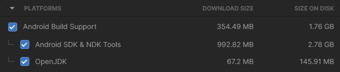

# OpenCV For Unity
Build and Run on Android device

Setup Guide of 'OpenCV For Unity' package
-----

Android Environment Setup
-----
1. Open Unity Hub ([Install link](https://unity.com/download)).
2. Select `Installs`.
3. Find the Editor you want to add the components to.
4. Click the :gear: to the right of the version label, then select `Add Modules`. (NOTE: If you didn’t install the Editor via the Hub, you might not see this option. To  enable this option, [install the Editor via the Hub](https://docs.unity3d.com/2021.1/Documentation/Manual/GettingStartedInstallingHub.html))
5. In the Add Modules dialog, locate the `Android Build Support` to add, tick its checkbox and click `Install`.
   

Build Settings
-----

1. Open the project in Unity.
2. Go to `File > Build Settings` (Ctrl+Shift+B), select `Android` and then click on `Switch Platform`.
3. Make sure your Android device is set up for [developer mode and USB debugging is enabled](./Android.md).

Build and Run
-----
1. Connect your Android device to your computer.
2. Open Unity and load your project.
3. Go to `File > Build and Run` (Ctrl+B). 
  
After the “Build and Run” step, your application should be installed and launched on your connected Android device.
